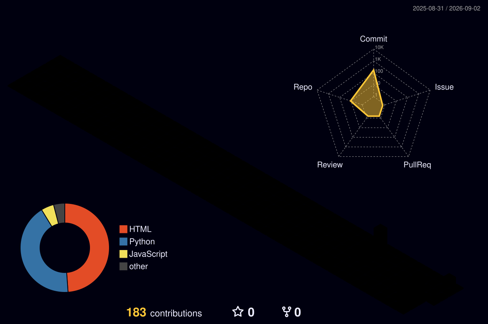

  <!-- Dynamic Typing Header -->
  

  

    <b>B.Tech in Computer Science & Engineering</b> • Shershah Engineering College, Sasaram[span_0](start_span)[span_0](end_span)
  

  <!-- Clean Badge Bar -->
  

    
    
    
    
  

---

### ⚡ Technical Arsenal

| Domain | Stack & Technologies |
| :--- | :--- |
| **Languages** | `Python` `C` `C++` `Java` `SQL` `JavaScript`[span_1](start_span)[span_1](end_span) |
| **Machine Learning / Vision** | `TensorFlow` `Keras` `OpenCV` `Scikit-Learn` `XGBoost` `CNNs`[span_2](start_span)[span_2](end_span) |
| **Data Science & Analytics** | `Pandas` `NumPy` `Matplotlib` `Seaborn` `Power BI` `Tableau`[span_3](start_span)[span_3](end_span) |
| **Web & Real-Time Backend** | `Node.js` `Express` `MongoDB` `Flask` `Socket.io` `Streamlit`[span_4](start_span)[span_4](end_span) |
| **DevOps & Developer Tools** | `Git` `GitHub Actions` `VS Code` `Jupyter` `Google Colab` `Arduino IDE`[span_5](start_span)[span_5](end_span) |

---

### 📂 Engineering Highlights & Case Studies

<table>
  <tr>
    <td width="50%" valign="top">
      <h3>🌿 <a href="https://github.com/priyanshu18611/EcoSentinel">EcoSentinel: IoT Wildlife System</a></h3>
      
End-to-end telemetry system capturing GPS, geofencing breaches, and vital metrics every 5 seconds[span_6](start_span)[span_6](end_span).

      <ul>
        <li>Real-time alert dispatching via <b>Socket.io</b> and <b>JWT</b> auth[span_7](start_span)[span_7](end_span).</li>
        <li>Interactive live map tracking with <b>Leaflet</b>[span_8](start_span)[span_8](end_span).</li>
      </ul>
      
<code>MERN Stack</code> <code>IoT Simulation</code> <code>Socket.io</code>[span_9](start_span)[span_9](end_span)

    </td>
    <td width="50%" valign="top">
      <h3>🧠 <a href="https://github.com/priyanshu18611/brain-tumor-detection">Brain Tumor Classification</a></h3>
      
Convolutional neural network detecting MRI scans as Tumor/Non-Tumor with zero leakage[span_10](start_span)[span_10](end_span).

      <ul>
        <li>4 Conv+MaxPooling stages with <b>Batch Normalization</b>[span_11](start_span)[span_11](end_span).</li>
        <li>Dropout regularization on augmented datasets[span_12](start_span)[span_12](end_span).</li>
      </ul>
      
<code>TensorFlow</code> <code>Keras</code> <code>OpenCV</code> <code>Deep Learning</code>[span_13](start_span)[span_13](end_span)

    </td>
  </tr>
  <tr>
    <td width="50%" valign="top">
      <h3>📊 <a href="https://github.com/priyanshu18611/enterprise-sales-analytics">Sales Intelligence Engine</a></h3>
      
Enterprise data warehouse built on Star Schema handling high-volume raw transaction logs[span_14](start_span)[span_14](end_span).

      <ul>
        <li><b>RFM Segmentation</b> using unsupervised K-Means clustering[span_15](start_span)[span_15](end_span).</li>
        <li>Executive reporting with complex <b>DAX</b> time-intelligence[span_16](start_span)[span_16](end_span).</li>
      </ul>
      
<code>Python ETL</code> <code>SQL Analytics</code> <code>Power BI</code>[span_17](start_span)[span_17](end_span)

    </td>
    <td width="50%" valign="top">
      <h3>🏏 <a href="https://github.com/priyanshu18611/Cricket-Score-Predictor">Live Cricket Score Predictor</a></h3>
      
Regression pipeline calculating final scores based on run rate, wickets, and venue dynamics[span_18](start_span)[span_18](end_span).

      <ul>
        <li>Trained with <b>XGBoost Regressor</b> on clean match logs[span_19](start_span)[span_19](end_span).</li>
        <li>Deployed as an interactive dashboard on <b>Streamlit</b>.</li>
      </ul>
      
<code>XGBoost</code> <code>Pandas</code> <code>Streamlit</code>[span_20](start_span)[span_20](end_span)

    </td>
  </tr>
  <tr>
    <td width="50%" valign="top">
      <h3>🌾 <a href="https://github.com/priyanshu18611/kisan-mitra">Kisan-Mitra</a> & <a href="https://github.com/priyanshu18611/AgroSmart-AI-Farmer-Assistant">AgroSmart AI</a></h3>
      
Smart farming suite providing weather trends, pest advisory, soil health, and Mandi price forecasts using ML.

      
<code>Machine Learning</code> <code>Agritech</code> <code>Python</code> <code>JavaScript</code>

    </td>
    <td width="50%" valign="top">
      <h3>🛡️ Security & Text Utilities</h3>
      
<b><a href="https://github.com/priyanshu18611/Spam-Mail-Detection">Spam Classifier</a></b> (TF-IDF + Logistic Reg) • <b><a href="https://github.com/priyanshu18611/Fake-Payment-Detector">Fraud Detection</a></b> • <b><a href="https://github.com/priyanshu18611/Resume-Parser">Resume Parser</a></b> (Streamlit + PyPDF2).

      
<code>NLP</code> <code>Fraud Analytics</code> <code>Automation</code>

    </td>
  </tr>
</table>

---

### 🐍 GitHub Contribution Eater

<picture>
  <source media="(prefers-color-scheme: dark)" srcset="dist/github-snake-dark.svg">
  <source media="(prefers-color-scheme: light)" srcset="dist/github-snake.svg">
  
</picture>

---

### 🌐 3D Contribution Matrix

  

---

### 📊 Performance & Commit Telemetry

  
  

  

