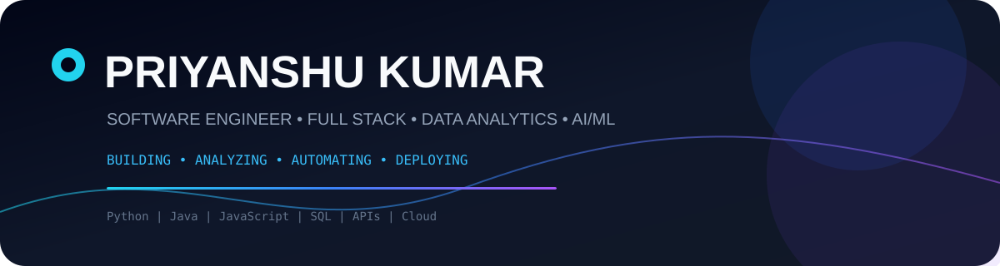
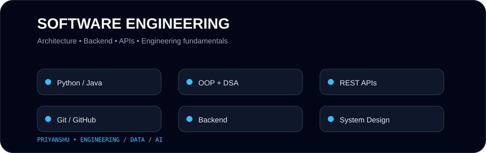
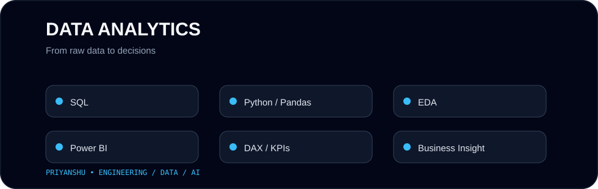
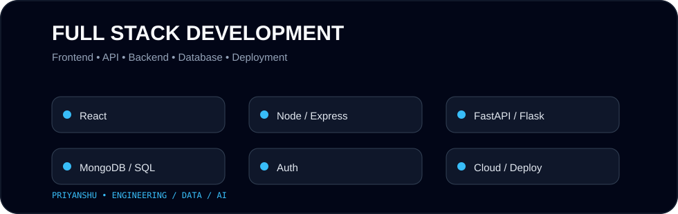
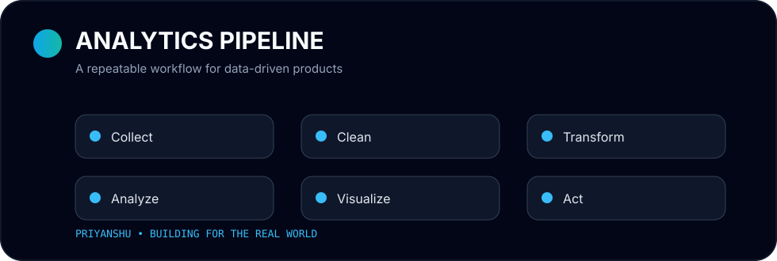
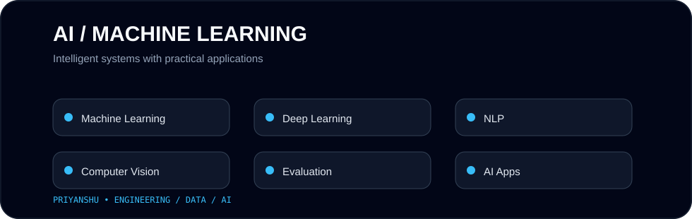

<div align="center">



<a href="https://github.com/priyanshu18611"></a>
<a href="https://priyanshu18611.github.io/portfolio/"></a>
<a href="https://www.linkedin.com/in/priyanshuroy18/"></a>

<br/><br/>

</div>

---

## 🧬 Engineering Identity

```text
PRIYANSHU KUMAR
├── 💻 Software Engineering
│   ├── Python • Java • JavaScript
│   ├── OOP • DSA • REST APIs
│   └── Backend & application fundamentals
├── 🌐 Full Stack Development
│   ├── React • Node.js • Express
│   ├── Flask • FastAPI
│   └── SQL • MongoDB • Authentication
├── 📊 Data Analytics
│   ├── Python • Pandas • NumPy
│   ├── SQL • EDA • Data Cleaning
│   └── Power BI • DAX • KPI Dashboards
└── 🤖 AI / ML
    ├── Machine Learning
    ├── Deep Learning
    ├── NLP
    └── Computer Vision
```

> **I build software, analyze data, and turn ideas into useful digital products.**

# 🏗️ My Engineering Stack

<div align="center">

<br/><br/>

<br/><br/>

</div>

---

# 🚀 Featured Builds

### 🤖 CareerPilot AI
AI-powered career intelligence platform for resume analysis, ATS optimization, job matching, AI career coaching, interview preparation and career roadmaps.

`Python` `FastAPI` `AI` `REST APIs` `Full Stack`

### 🌿 EcoSentinel
IoT wildlife monitoring platform with real-time monitoring concepts, maps, alerts, geofencing and authenticated communication.

`MERN` `Socket.io` `JWT` `IoT` `Leaflet`

### 📊 Enterprise Sales Analytics
Business intelligence workflow with Python ETL, SQL analytics, RFM segmentation, cohort analysis, Power BI and DAX KPIs.

`Python` `SQL` `Power BI` `DAX`

### 🧠 Brain Tumor Detection
Computer vision / deep learning project using MRI image processing and CNN-based classification.

`Python` `TensorFlow` `Keras` `OpenCV`

### 🏏 Cricket Score Predictor
Machine learning prediction application using match-state features and a prediction interface.

`Python` `Pandas` `NumPy` `Scikit-learn` `XGBoost`

### 🛡️ Spam Mail Detection
NLP classification pipeline using TF-IDF and Logistic Regression.

```text
Email → Cleaning → TF-IDF → Logistic Regression → Classification
```

---

# 🌐 Product Architecture

```text
USER
  ↓
FRONTEND → API LAYER → BACKEND
                         ↓
             ┌───────────┼───────────┐
             ↓           ↓           ↓
          DATABASE     AI / ML    ANALYTICS
             └───────────┼───────────┘
                         ↓
                    DEPLOYMENT
```

# 📊 Analytics Mindset

<div align="center">

</div>

`DATA → CLEAN → TRANSFORM → ANALYZE → VISUALIZE → INSIGHT → ACTION`

# 🤖 AI / ML Playground

<div align="center">

</div>

`Machine Learning` · `Deep Learning` · `NLP` · `Computer Vision` · `Model Evaluation`

---

# 🛠️ Technology Arsenal

### 💻 Programming Languages
<p>

</p>

### 🌐 Full Stack & Backend
<p>

</p>

### 🤖 AI / ML & Data
<p>

</p>

`Pandas` · `NumPy` · `Scikit-learn` · `SQL` · `Power BI` · `DAX`

### 🔧 Tools & Engineering
<p>

</p>

`REST APIs` · `Authentication` · `JWT` · `Data Cleaning` · `EDA` · `Dashboards` · `Deployment`

---

# 📈 GitHub Intelligence

<div align="center">


<br/><br/>

</div>

---

# 🐍 Contribution Matrix

<div align="center">

</div>

---

# 🎯 Current Mission

```text
💻 Advanced Software Engineering
🌐 Full Stack Application Development
📊 Advanced Data Analytics
📈 Power BI & Business Intelligence
🤖 AI / Machine Learning
☁️ Cloud & Deployment
🧠 DSA & Problem Solving
🏗️ System Design
```

# 🏆 Experience

### 🚆 East Central Railway — S&T Internship
Exposure to Optical Fibre Communication, Telephone Exchange, Quad Cable Communication, Public Announcement Systems, PRS/UTS systems and Mobile Train Radio Communication.

### 🛡️ Cisco — Introduction to Cybersecurity
Fundamental cybersecurity, threat awareness and defensive concepts.

---

# 💼 Open to Opportunities

### `Software Engineer` · `Full Stack Developer` · `Python Developer` · `Data Analyst` · `AI/ML`

Interested in real-world engineering problems, collaborative teams, scalable applications and data/AI-driven products.

---

<div align="center">

### ⚡ CODE • ANALYZE • BUILD • DEPLOY • EVOLVE


</div>
