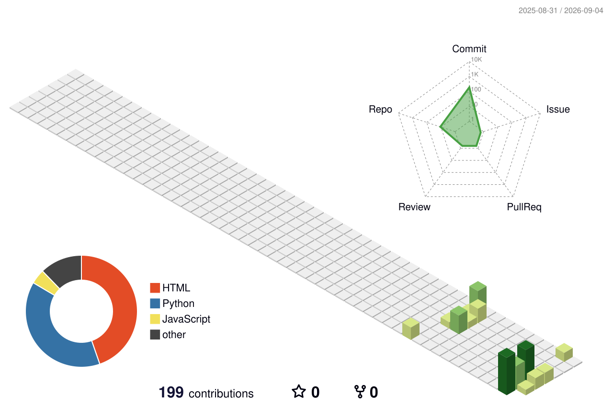

  <h1>👨‍💻 Priyanshu Kumar</h1>
  
🚀 <b>B.Tech in Computer Science & Engineering</b> | Machine Learning & Full-Stack Developer

  

    
    
    
  

---

### 🌟 About Me
* 🎓 Computer Science undergraduate at **Shershah Engineering College, Sasaram** (Batch 2022–2026)[span_0](start_span)[span_0](end_span).
* 💡 Strong focus on **Machine Learning, Deep Learning (CNNs), Data Analytics**, and **Full-Stack Development**[span_1](start_span)[span_1](end_span).
* 🛠️ Prior experience as a **Signal & Telecom Intern at East Central Railway**[span_2](start_span)[span_2](end_span) and **Cloud Computing Intern at Aagaaz Training Centre**[span_3](start_span)[span_3](end_span).
* 📈 Passionate about building data-driven systems, IoT real-time pipelines, and scalable web apps[span_4](start_span)[span_4](end_span).

---

### 🛠️ Tech Stack

**Languages & Core:**  

**Libraries, ML & Data Science:**  

**Web & Cloud / Tools:**  

---

### 🚀 Key Projects

* **EcoSentinel (IoT & Wildlife Conservation):** Full-stack MERN & IoT application featuring live map visualization with Leaflet, real-time alerts via Socket.io, and role-based JWT authentication[span_5](start_span)[span_5](end_span).
* **Brain Tumor Detection:** Deep learning CNN architecture built on TensorFlow/Keras with data augmentation and Dropout regularization to classify MRI scans[span_6](start_span)[span_6](end_span).
* **Enterprise Sales Analytics Engine:** Star schema data warehouse and Python ETL pipeline with RFM-based K-Means clustering and DAX time-intelligence dashboards in Power BI[span_7](start_span)[span_7](end_span).
* **Cricket Score Predictor:** ML pipeline powered by XGBoost Regressor to predict match totals using live match data and historical metrics[span_8](start_span)[span_8](end_span).

---

### 🐍 GitHub Contribution Snake
<picture>
  <source media="(prefers-color-scheme: dark)" srcset="dist/github-snake-dark.svg">
  <source media="(prefers-color-scheme: light)" srcset="dist/github-snake.svg">
  
</picture>

---

### 📊 3D Contribution Graph

  

---

### 📈 GitHub Analytics

  
  

  

