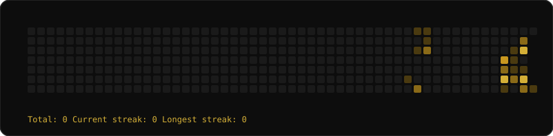

<h3 align="center"><code>Priyanshu Kumar</code></h3>

<table align="center">
<tr>
<td></td>
<td></td>
</tr>
</table>

<h3><code>Contributions</code></h3>

<h3><code>Featured Projects</code></h3>

<table>
<tr>
<td width="50%">

**🌿 EcoSentinel — IoT Wildlife Conservation**
Full-stack MERN app for real-time wildlife tracking with simulated GPS collars, Leaflet live maps, Socket.io geofence/vitals alerts, and JWT auth.
`MERN` `Socket.io` `JWT` `IoT`
[Repo →](https://github.com/priyanshu18611)

</td>
<td width="50%">

**🧠 Brain Tumor Detection (MRI)**
CNN classifier (TensorFlow/Keras) with 4 Conv+MaxPool blocks, BatchNorm, augmentation & dropout, evaluated via confusion matrix and accuracy/loss plots.
`Deep Learning` `CNN` `OpenCV`
[Repo →](https://github.com/priyanshu18611)

</td>
</tr>
<tr>
<td width="50%">

**🏏 Cricket Score Predictor**
ML model predicting final scores from live match state (runs, wickets, overs, run rate) using an XGBoost Regressor on cleaned historical datasets.
`Python` `XGBoost` `Scikit-learn`
[Repo →](https://github.com/priyanshu18611)

</td>
<td width="50%">

**📊 Enterprise Sales Analytics**
Star-schema warehouse + Python ETL, K-Means RFM customer segmentation, SQL cohort retention, and a Power BI model with DAX KPIs.
`SQL` `Scikit-learn` `Power BI`
[Repo →](https://github.com/priyanshu18611)

</td>
</tr>
</table>

<h3><code>Tech Arsenal</code></h3>

**Frontend**

**Backend / Data**

**ML / Data Science**

**Tools / Platforms**

<h3><code>What I'm Up To</code></h3>

| 🔭 Currently Building | 📚 Currently Learning | ⚡ Fun Fact |
|---|---|---|
| ML + full-stack projects blending data pipelines with real-time apps | Cloud (AWS), advanced SAP & Power BI | Balances railway comms internships with deep learning side projects |

<h3><code>Achievements</code></h3>

<h3><code>Socials</code></h3>

