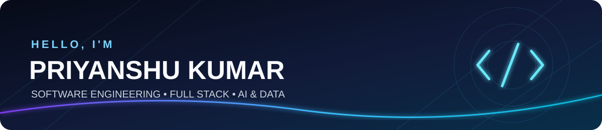
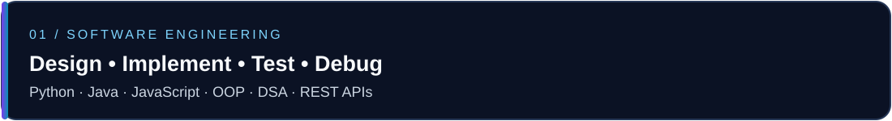
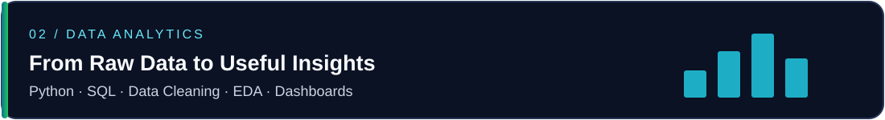
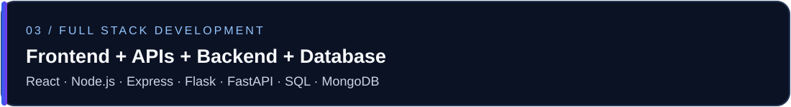
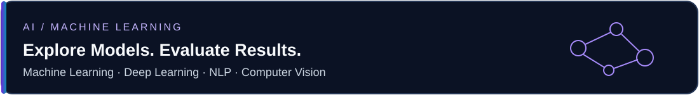

<div align="center">



<a href="https://github.com/priyanshu18611"></a>
<a href="https://priyanshu18611.github.io/portfolio/"></a>
<a href="https://www.linkedin.com/in/priyanshuroy18/"></a>

<br/><br/>

</div>

---

## 🧬 Engineering Identity

```text
PRIYANSHU KUMAR
├── 💻 Software Engineering
│   ├── Python • Java • JavaScript
│   ├── OOP • DSA • REST APIs
│   └── Backend & application fundamentals
├── 🌐 Full Stack Development
│   ├── React • Node.js • Express
│   ├── Flask • FastAPI
│   └── SQL • MongoDB • Authentication
├── 📊 Data Analytics
│   ├── Python • Pandas • NumPy
│   ├── SQL • EDA • Data Cleaning
│   └── Power BI • DAX • KPI Dashboards
└── 🤖 AI / ML
    ├── Machine Learning
    ├── Deep Learning
    ├── NLP
    └── Computer Vision
```

> **I build software, analyze data, and turn ideas into useful digital products.**

# 🏗️ My Engineering Stack

<div align="center">

<br/><br/>

<br/><br/>

</div>

---

# 🚀 Featured Builds

### 🤖 CareerPilot AI
AI-powered career intelligence platform concept for resume analysis, ATS optimization, job matching, career coaching, interview preparation and career roadmaps.

`Python` `FastAPI` `AI` `REST APIs` `Full Stack`

### 🌿 EcoSentinel
Wildlife conservation application concept with a full-stack architecture, REST APIs, real-time Socket.io alerts and JWT authentication.

`React` `Node.js` `Express` `MongoDB` `Socket.io` `JWT`

### 📊 Enterprise Sales Analytics
Data analytics project area covering Python data workflows, SQL analysis and business intelligence dashboards. Add the dedicated repository link and only claim features that are implemented.

`Python` `SQL` `Power BI` `DAX`

### 🧠 Brain Tumor Detection
Computer-vision / deep-learning project focused on MRI image classification.

`Python` `TensorFlow` `Keras` `OpenCV`

### 🏏 Cricket Score Predictor
Machine-learning project for cricket score prediction.

`Python` `Pandas` `NumPy` `Scikit-learn`

### 🛡️ Spam Mail Detection
Machine-learning project for classifying spam messages.

`Python` `Machine Learning` `NLP`

### 📄 Resume Parser
Python tool for extracting structured data from PDF resumes, with a Streamlit interface.

`Python` `Streamlit` `PyPDF2`

### 🌦️ Weather Dashboard
Responsive weather dashboard web application.

`HTML` `CSS` `JavaScript`

> Browse all repositories: [github.com/priyanshu18611](https://github.com/priyanshu18611?tab=repositories)

---

# 🌐 Product Architecture

```text
USER
  ↓
FRONTEND → API LAYER → BACKEND
                         ↓
             ┌───────────┼───────────┐
             ↓           ↓           ↓
          DATABASE     AI / ML    ANALYTICS
             └───────────┼───────────┘
                         ↓
                    DEPLOYMENT
```

# 📊 Analytics Mindset

<div align="center">

</div>

`DATA → CLEAN → TRANSFORM → ANALYZE → VISUALIZE → INSIGHT → ACTION`

# 🤖 AI / ML Playground

<div align="center">

</div>

`Machine Learning` · `Deep Learning` · `NLP` · `Computer Vision` · `Model Evaluation`

---

# 🛠️ Technology Arsenal

### 💻 Programming Languages
<p>

</p>

### 🌐 Full Stack & Backend
<p>

</p>

### 🤖 AI / ML & Data
<p>

</p>

`Pandas` · `NumPy` · `Scikit-learn` · `SQL` · `Power BI` · `DAX`

### 🔧 Tools & Engineering
<p>

</p>

`REST APIs` · `Authentication` · `JWT` · `Data Cleaning` · `EDA` · `Dashboards` · `Deployment`

---

# 📈 GitHub Intelligence

<div align="center">


<br/><br/>

</div>

---

# 🐍 Contribution Matrix

<div align="center">

</div>

---

# 🎯 Current Mission

```text
💻 Advanced Software Engineering
🌐 Full Stack Application Development
📊 Data Analytics & Business Intelligence
📈 Power BI & Business Intelligence
🤖 AI / Machine Learning
☁️ Cloud & Deployment
🧠 DSA & Problem Solving
🏗️ System Design
```

# 🏆 Experience

### 🚆 East Central Railway — S&T Internship
Exposure to Optical Fibre Communication, Telephone Exchange, Quad Cable Communication, Public Announcement Systems, PRS/UTS systems and Mobile Train Radio Communication.

### ☁️ Aagaaz Training Centre — Cloud Computing Internship
Completed a four-week remote training program covering cloud computing fundamentals, virtualization and cloud service models.

### 🤖 InfinityCore Technologies — Robotics Internship
Completed remote robotics assignments focused on practical problem-solving and debugging.

### 🛡️ Cisco — Introduction to Cybersecurity
Completed introductory cybersecurity learning.

---

# 💼 Open to Opportunities

### `Software Engineer` · `Full Stack Developer` · `Python Developer` · `Data Analyst` · `AI/ML`

Interested in real-world engineering problems, collaborative teams, scalable applications and data/AI-driven products.

---

<div align="center">

### ⚡ CODE • ANALYZE • BUILD • DEPLOY • EVOLVE


<sub>Built by Priyanshu Kumar</sub>

</div>
